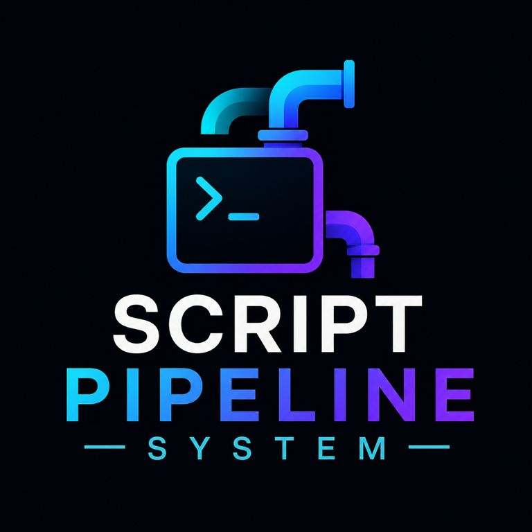

# Script Pipeline System




A lightweight, zero-overhead pipeline designed to execute standalone Python scripts seamlessly like native command-line tools, built specifically to integrate with **Orthodox File Managers (OFM)**.

---

## ⚡ Quick Start & Overview

The pipeline wraps Python scripts behind a single unified launcher (`epy.bat`), allowing scripts to be executed headlessly from the terminal, triggered via simple command aliases, or launched as interactive graphical applications without altering a single line of script code.

### Main Entry Point

```cmd
epy script.py [arguments]

```

### Basic Execution Modes

* **Headless CLI:** `epy script.py --path "D:/Project" --print_full_list`

* **Interactive UI:** Hold **Left Ctrl** while launching the script from the terminal or file manager.


* **Command Alias:** Call wrappers directly by name (e.g., `tree` or `image_resize`).


* **Context-Aware Presets:** Automatically switches between global defaults and localized project presets (e.g., inside a Unity project folder containing a `.uscript` directory).


---

## 🔧 Environments & Backends (`epy.bat`)

All scripts route through `epy.bat`, which manages environment isolation and Python interpreter dispatching. It prints the current backend and environment on startup before passing all command-line arguments (`%*`) directly to the target script.

You can configure the active execution backend by editing the `BACKEND` and `ENV` variables inside `epy.bat`:

| Backend | Description | Behavior |
| --- | --- | --- |
| **`conda`** *(Default)* | Miniconda / Anaconda

 | Activates the configured environment (default: `dev`) via `activate.bat` before executing.

 |
| **`micromamba`** | Fast C++ Conda alternative

 | Runs cleanly inside the environment using `micromamba run -n dev python`.

 |
| **`default`** | System Python

 | Bypasses virtual environments and executes directly against the system `python` PATH.

 |

---

## 🚀 Execution Workflows

### 1. Command-Line Interface (CLI)

When invoked normally from a terminal or script, the target Python script executes headlessly.

* Script parameters are defined internally in the script's `DEFAULTS` configuration.


* Any explicitly passed `--param value` command-line flags cleanly override the script's default values.


### 2. Command Aliases (`.cmd` Wrappers)

Instead of typing full script paths, individual scripts can be exposed to your system `PATH` using minimal `.cmd` wrapper files:

* **`image_resize.cmd`**: `epy "c:\Apps\user-scripts\Images\image_resize.py" %*`

* **`tree.cmd`**: `epy "c:\Apps\user-scripts\FileSystem\print_tree.py" %*`

* **`emojis_all.cmd`**: `epy "c:\Apps\user-scripts\Cheatsheets\emojis_all.py" %*`


### 3. Interactive Mode (GUI)

By holding down the **Left Ctrl** key while executing a command or alias, the script intercepts execution and opens an interactive Dear PyGui interface.

**Interactive Mode Capabilities:**

* **Live Parameter Tweaking:** Modify paths, toggles, and patterns before executing the script.


* **Dual-Scope Presets:** Seamlessly switch between universal global presets and localized project presets.


* **Embedded Diagnostics:** View live console output and debugging streams directly within the UI's built-in log viewer.


### 4. OFM & File Manager Integration

Scripts are structured to act as native extensions for Orthodox File Managers (like Double Commander or Total Commander).

* Tools can be triggered directly from command bars or hotkeys.


* Scripts dynamically resolve the file manager's active working directory (`--cwd`) or currently selected files (`--selected`) as their execution targets.


---

## 🌐 Domain Resolution & Preset Scopes (Global vs. Local Mode)

The pipeline features an intelligent domain resolution system that adapts script presets to your current working environment. When running a script, it evaluates execution paths (checking `--cwd`, script `--path`, or `--selected` items) and traverses upward through the filesystem structure looking for a **`.uscript`** domain directory.

```
D:\Projects\Ubisoft\MyGame\           <-- Project Domain Root (Name: MyGame)
├── .uscript\                         <-- Local Domain Directory Discovered!
│   ├── print_tree.presets.json       <-- Local Project Presets
│   └── prefix_header.md              <-- Project-specific markdown prefixes
├── Assets\
│   └── Scripts\                      <-- Execution target (e.g., CLI current working dir)

```

### 1. Global Mode (Universal Defaults)

* **Storage Location:** Saved directly alongside the tool executable: `<script_dir>/<script>.presets.json`.


* **Behavior:** Available globally regardless of where the script is executed.


* **Default Enforcement:** The system automatically creates and enforces a immutable **`Default`** preset representing the script's raw baseline values.


### 2. Local Mode (Project Domain Presets)

* **Storage Location:** Saved inside the discovered domain folder: `<project_root>/.uscript/<script>.presets.json`.


* **Behavior:** Activated automatically when running inside a project directory (such as a Unity game repository).


* **Project Isolation:** Allows you to maintain project-specific formatting conventions, ignore patterns, or custom prefix files without polluting your global script configurations.


### UI Display

In Interactive Mode, both scopes appear as separate, expandable preset panels:

* **`### PRESETS`**: Universal global presets.


* **`### PRESETS [Project Name]`**: Active local domain presets (e.g., `PRESETS [MyGame]`).


* Selecting a preset in one panel automatically deselects the other to maintain a single, clear active configuration state across your workspace.


---

## 📁 Logging & Diagnostics

The pipeline separates interactive debugging logs from standard script job output:

* **Interactive Mode Debugging:** When running via GUI, UI state and application diagnostics are written to `<script>.im_mode.log` next to the source script.


* **Script Execution Output:** Standard script jobs write their logs (controlled via the `log_file` parameter) directly to the active working directory. When `log_name_from_dir` is enabled, the log filename dynamically inherits the target directory's name (e.g., `MyGame.log`).


---

## 🧠 Architectural Philosophy

* **CLI-First Behavior:** Every utility must be fully functional as a headless command-line tool before graphical layers are applied.


* **Context-Aware Execution:** Tools adapt their behavior and configurations automatically based on the working directory domain.


* **Zero Global Bloat:** Scripts remain modular and self-contained without polluting global system paths.


* **Write Once, Run Anywhere:** A single script implementation seamlessly adapts to terminal automation, interactive UI tweaking, and file manager toolbar integration.